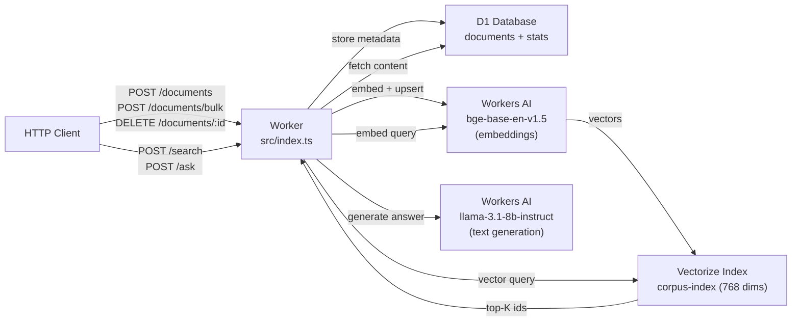

# vector-brain

Corpus management + semantic search + RAG powered by Cloudflare Vectorize, Workers AI, and D1.

## Architecture



## Endpoints

| Method | Path | Description |
|--------|------|-------------|
| `POST` | `/documents` | Add single document |
| `POST` | `/corpus` | Alias for `POST /documents` |
| `POST` | `/documents/bulk` | Bulk insert up to 100 documents |
| `POST` | `/corpus/bulk` | Alias for `POST /documents/bulk` |
| `GET` | `/documents` | List corpus (paginated, `?limit=&offset=`) |
| `GET` | `/documents/:id` | Get single document |
| `DELETE` | `/documents/:id` | Remove from D1 + Vectorize |
| `POST` | `/search` | Semantic search `{ query, topK? }` — topK capped at 20 |
| `POST` | `/ask` | RAG answer with citations `{ question, topK? }` — topK capped at 10 |
| `GET` | `/stats` | Corpus stats (total docs, last indexed) |

## Pre-deploy Setup

```bash
npm install

# 1. Create Vectorize index (one-time — must match embedding model dimensions)
npm run vector:create
# Uses @cf/baai/bge-base-en-v1.5 = 768 dimensions, cosine metric

# 2. Create D1 database
npm run db:create     # → copy database_id into wrangler.toml

# 3. Apply migrations (local)
npm run db:migrate:local
npm run dev

# 4. Production deploy
npm run deploy
```

## Seed Corpus (50+ docs for MJ review)

```bash
# Example: bulk insert using curl
curl -X POST https://<worker>.workers.dev/documents/bulk \
  -H "Content-Type: application/json" \
  -d '[
    {"title": "Cloudflare Workers", "content": "Workers run JS at the edge..."},
    {"title": "D1 Database", "content": "D1 is a SQLite-compatible serverless DB..."},
    ...50 more...
  ]'
```

## Tests

```bash
npm test
```

Covers: document CRUD, search, ask, stats, error handling.
